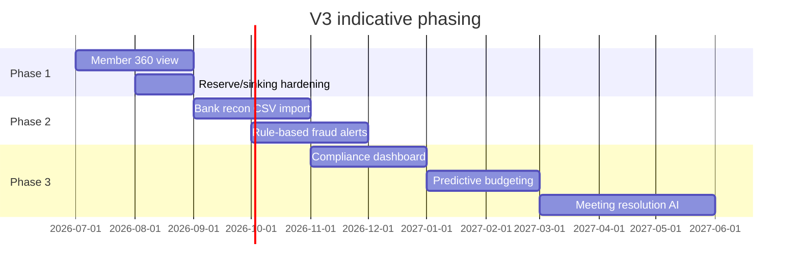
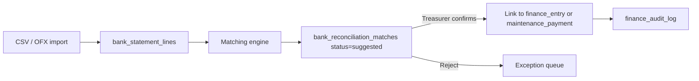
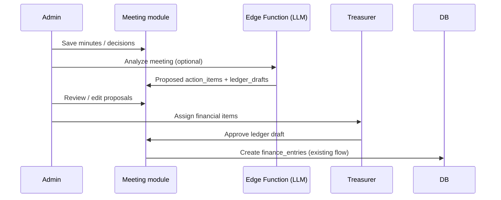

# Kutumbika — V3 Accounting & Governance Extensions

> **Scope:** Planned modules **beyond V2 core accounting** — member intelligence, bank reconciliation, forecasting, statutory funds, meeting AI, compliance, and fraud detection.
>
> **Shipped baseline:** [VERSION-2-RELEASE.md](./VERSION-2-RELEASE.md) · **Finance traceability:** [architecture/FINANCIAL-DATA-FLOW.md](./architecture/FINANCIAL-DATA-FLOW.md) · **Prior roadmap:** [PRODUCT-V2.md](./PRODUCT-V2.md)

This is a living product spec. Phasing and schema are indicative until prioritized with pilot societies.

---

## 1. Vision

V3 makes Kutumbika the **single source of truth** for committee treasurers and residents: one flat-centric view of obligations and history, automated reconciliation against bank reality, forward-looking cash planning, and proactive compliance — without parallel ledgers or shadow databases.

**Design principles**

| Principle | Rule |
|-----------|------|
| **One ledger** | All money posts to existing `finance_entries` / `maintenance_payments`; new modules link, never duplicate |
| **Human-in-the-loop** | AI and auto-match propose; treasurer or MC approves before irreversible posts |
| **Flat as anchor** | Member 360° is keyed by `flat_id` / `flat_number`; members are household detail |
| **Audit everything** | Reconciliation matches, anomaly flags, and AI proposals write to append-only logs |
| **Society-configurable** | Statutory obligations, fund rules, and alert thresholds vary by society |

---

## 2. Module map vs V2 baseline

| V3 module | V2 already ships | V3 adds |
|-----------|------------------|---------|
| Member 360° Profile | `flats`, `members`, maintenance, notifications, parking, meetings attendance, `support_tickets` | Unified timeline UI + summary cards; optional ownership history |
| Bank Reconciliation | Cash/bank channel on ledger, head-fund & event-food reconciliation, self-audit | Bank statement import + auto-match + exception queue |
| Predictive Budgeting | Period report, cash flow statement, flat report | Collection/expense forecasts, cash runway, repair scenarios |
| Reserve & Sinking Fund | `reserve_fund_transfers`, corpus destination on ledger, `operatingReserveFund.ts` | Statutory fund types, draw rules, dedicated fund statements |
| Meeting & Resolution AI | Full meetings module (minutes, decisions, attendance, documents) | Extract tasks, approvals, draft ledger impacts from minutes |
| Compliance Dashboard | `society_documents`, governance guide, audit logs | Obligation calendar, filing status, document expiry alerts |
| Fraud & Anomaly Detection | Duplicate payment alarms, 10-check self-audit, manual audit tracer | Vendor/invoice rules, price trends, withdrawal patterns |

---

## 3. Phasing (indicative)



| Milestone | Modules | Outcome |
|-----------|---------|---------|
| **V3.0** | Member 360°, Reserve/sinking hardening | Admin/resident sees full flat story; statutory funds reported separately |
| **V3.1** | Bank reconciliation (CSV), Fraud rules | Treasurer closes books against bank; anomalies surfaced in Finance → Audit |
| **V3.2** | Compliance dashboard | Obligations + document expiry on one screen with notifications |
| **V3.3** | Predictive budgeting, Meeting AI | Forward cash view; minutes → actionable proposals (approve to post) |

**Prerequisite (from V2.1 backlog):** append-only `finance_audit_log` and soft-delete on `finance_entries` — see [FINANCIAL-DATA-FLOW.md](./architecture/FINANCIAL-DATA-FLOW.md#traceability-gaps-v2).

---

## 4. Module specifications

### 4.1 Member 360° Profile

**Problem:** Treasurer, secretary, and residents jump between Residents, Finance, Parking, Meetings, and feedback — no single flat-centric history.

**Current data sources**

| Domain | Tables / UI |
|--------|-------------|
| Ownership & household | `flats`, `members`, `resident_users`, `committee_members` |
| Dues & payments | `maintenance_charges`, `maintenance_payments`, `finance_entry_allocations` |
| Notices | `notifications` (`target_type = flat`) |
| Complaints / feedback | `support_tickets` (`flat_number`, `society_id`) |
| Parking | `parking_spaces` (`allocated_flat_id`, `allocated_flat_number`) |
| Meetings | `meeting_attendees` (`flat_number`, `member_id`, `is_present`) |
| Events | `event_contributions`, `event_rsvps` |
| Visitors | `visitors` (`flat_number`) — optional, guard-sensitive |

**Proposed UI**

- **Admin:** Residents tab → select flat → **360°** sub-view (or dedicated route `/admin/flats/:id`)
- **Resident:** Own flat only (existing `ResidentDashboard` enrichment)
- **Layout:** Summary cards (dues status, last payment, open tickets, parking slot, attendance %) + chronological **timeline** (payments, notices, meetings, tickets, visitors)

**Schema (minimal — view-first)**

No new transactional tables required for V3.0. Optional enrichment:

```sql
-- Optional: flat ownership history (sale, tenant change)
CREATE TABLE public.flat_ownership_history (
  id uuid PRIMARY KEY DEFAULT gen_random_uuid(),
  flat_id uuid NOT NULL REFERENCES public.flats(id) ON DELETE CASCADE,
  society_id uuid NOT NULL REFERENCES public.societies(id) ON DELETE CASCADE,
  owner_name text NOT NULL,
  owner_phone text,
  relation text, -- owner | tenant | co-owner
  effective_from date NOT NULL,
  effective_to date,
  notes text,
  created_by text,
  created_at timestamptz NOT NULL DEFAULT now()
);
```

**RPC / API pattern**

```sql
-- Returns JSON timeline for one flat (server-side aggregation)
CREATE OR REPLACE FUNCTION public.get_flat_360_profile(
  p_society_id uuid,
  p_flat_id uuid,
  p_limit int DEFAULT 50
) RETURNS jsonb
LANGUAGE sql STABLE SECURITY DEFINER AS $$
  -- Aggregate: members, dues summary, recent payments, tickets, parking,
  -- meeting attendance count, notifications — ordered timeline
$$;
```

**Acceptance criteria**

- [ ] Admin with `residents` read sees 360° for any flat in society
- [ ] Resident sees 360° for own flat only
- [ ] Timeline shows last 12 months by default; load more paginates
- [ ] Dues card matches Finance → Flat report totals for selected period
- [ ] No duplicate writes — read-only aggregation over existing tables
- [ ] Flutter parity: flat summary on resident home (Phase 2 of mobile parity)

**RBAC:** `residents` read; no new permission key required (subset of residents module).

---

### 4.2 Bank Reconciliation Engine

**Problem:** Treasurers manually compare bank passbook / UPI export with app receipts and expenses. Channel totals in period report do not prove row-level match.

**Current support**

- `normalizePaymentChannel()` in `financeAuditDetection.ts` — cash vs bank vs other
- Self-audit checks cash/bank balances and orphans
- No bank statement entity

**Proposed flow**



**Schema sketch**

```sql
CREATE TABLE public.bank_statement_imports (
  id uuid PRIMARY KEY DEFAULT gen_random_uuid(),
  society_id uuid NOT NULL REFERENCES public.societies(id) ON DELETE CASCADE,
  bank_name text,
  account_last4 text,
  period_from date NOT NULL,
  period_to date NOT NULL,
  file_name text,
  imported_by text,
  created_at timestamptz NOT NULL DEFAULT now()
);

CREATE TABLE public.bank_statement_lines (
  id uuid PRIMARY KEY DEFAULT gen_random_uuid(),
  import_id uuid NOT NULL REFERENCES public.bank_statement_imports(id) ON DELETE CASCADE,
  society_id uuid NOT NULL REFERENCES public.societies(id) ON DELETE CASCADE,
  line_date date NOT NULL,
  amount numeric NOT NULL, -- positive = credit, negative = debit
  description text,
  reference text, -- UPI ref, cheque no, NEFT UTR
  balance_after numeric,
  raw_row jsonb,
  created_at timestamptz NOT NULL DEFAULT now()
);

CREATE TABLE public.bank_reconciliation_matches (
  id uuid PRIMARY KEY DEFAULT gen_random_uuid(),
  statement_line_id uuid NOT NULL REFERENCES public.bank_statement_lines(id) ON DELETE CASCADE,
  society_id uuid NOT NULL REFERENCES public.societies(id) ON DELETE CASCADE,
  match_type text NOT NULL CHECK (match_type IN (
    'maintenance_payment', 'finance_entry', 'split_combined'
  )),
  maintenance_payment_id uuid REFERENCES public.maintenance_payments(id) ON DELETE SET NULL,
  finance_entry_id uuid REFERENCES public.finance_entries(id) ON DELETE SET NULL,
  match_confidence numeric NOT NULL DEFAULT 0, -- 0..1
  status text NOT NULL DEFAULT 'suggested' CHECK (status IN (
    'suggested', 'confirmed', 'rejected', 'manual'
  )),
  matched_by text,
  matched_at timestamptz,
  notes text,
  created_at timestamptz NOT NULL DEFAULT now(),
  CONSTRAINT bank_recon_one_target CHECK (
    (maintenance_payment_id IS NOT NULL)::int + (finance_entry_id IS NOT NULL)::int >= 1
  )
);

CREATE UNIQUE INDEX bank_recon_payment_unique
  ON public.bank_reconciliation_matches (maintenance_payment_id)
  WHERE maintenance_payment_id IS NOT NULL AND status = 'confirmed';

CREATE UNIQUE INDEX bank_recon_entry_unique
  ON public.bank_reconciliation_matches (finance_entry_id)
  WHERE finance_entry_id IS NOT NULL AND status = 'confirmed';
```

**Matching rules (V3.1 — rules engine, not ML)**

| Signal | Weight |
|--------|--------|
| Exact amount | Required for auto-suggest |
| Date within ±3 days (configurable) | High |
| UPI/UTR in `transaction_id` or `reference` | High |
| Flat number in narration | Medium |
| Vendor name fuzzy match on expenses | Medium |

**Acceptance criteria**

- [ ] Import CSV with columns: date, amount, description, reference (template downloadable)
- [ ] Suggested matches shown with confidence; bulk confirm for high-confidence rows
- [ ] Confirmed match does not alter ledger amounts — only links statement line to existing row
- [ ] Unmatched credits/debits listed in exception queue with export
- [ ] Reconciliation summary: statement total vs matched vs unmatched per period
- [ ] Audit log entry on every confirm/reject
- [ ] Bank API integration deferred to V3.2+

**RBAC:** `finance` write (treasurer-only sub-tab: **Bank recon** under Finance → Audit area).

---

### 4.3 Predictive Budgeting

**Problem:** Committees plan repairs and rate changes without a forward cash view grounded in actual collection history.

**Inputs (existing)**

- Verified `maintenance_payments` + charge definitions → collection rate by month
- `finance_entries` where `destination = separate_entry` → expense by `expense_groups.major_head`
- `reserve_fund_transfers` → reserve balance trajectory
- Opening balances (society settings / finance opening balance migration)

**Schema sketch**

```sql
CREATE TABLE public.budget_scenarios (
  id uuid PRIMARY KEY DEFAULT gen_random_uuid(),
  society_id uuid NOT NULL REFERENCES public.societies(id) ON DELETE CASCADE,
  name text NOT NULL, -- e.g. "FY 2026-27 baseline"
  base_month text NOT NULL, -- YYYY-MM anchor
  horizon_months int NOT NULL DEFAULT 12 CHECK (horizon_months BETWEEN 1 AND 36),
  assumptions jsonb NOT NULL DEFAULT '{}'::jsonb,
  -- e.g. { "collection_rate": 0.92, "maintenance_growth_pct": 5, "inflation_pct": 6 }
  created_by text,
  created_at timestamptz NOT NULL DEFAULT now()
);

CREATE TABLE public.budget_scenario_lines (
  id uuid PRIMARY KEY DEFAULT gen_random_uuid(),
  scenario_id uuid NOT NULL REFERENCES public.budget_scenarios(id) ON DELETE CASCADE,
  month text NOT NULL, -- YYYY-MM
  line_kind text NOT NULL CHECK (line_kind IN (
    'projected_inflow', 'projected_outflow', 'opening_balance',
    'closing_balance', 'one_time_repair'
  )),
  category text, -- major_head or 'maintenance' | 'reserve_draw'
  amount numeric NOT NULL,
  notes text
);
```

**UI**

- Finance → **Forecast** tab (or REPORTS → Planning)
- Charts: cash runway, collection vs expense trend, scenario compare (baseline vs +10% maintenance)
- One-time repair line items (elevator, waterproofing) with optional link to reserve draw proposal

**Acceptance criteria**

- [ ] Default scenario uses trailing 12-month verified data for rates
- [ ] User can override collection rate and monthly charge growth %
- [ ] Closing balance = opening + inflows − outflows − one-time items
- [ ] Export PDF for MC meeting pack
- [ ] Clearly labeled **projection** — not posted to ledger

**RBAC:** `finance` read minimum; write to create/edit scenarios.

---

### 4.4 Reserve Fund & Sinking Fund Tracking

**Problem:** V2 tracks reserve transfers and corpus ledger destination, but societies need **statutory separation** (sinking/corpus vs operating reserve vs emergency) with draw guardrails.

**Current**

- `reserve_fund_transfers` — operating ↔ reserve ↔ fixed ↔ emergency
- Ledger `destination` includes corpus/sinking paths; `event_food_fund_adjustments.source_type` includes `corpus`
- `MonthlyOperatingFundPanel`, `operatingReserveFund.ts`

**V3 enhancements**

1. **Fund registry** — society defines named funds with type and minimum balance
2. **Fund statements** — per-fund inflow/outflow/balance (derived from transfers + tagged ledger rows)
3. **Draw approval** — optional MC resolution reference before `reserve_to_*` above threshold

**Schema sketch**

```sql
CREATE TYPE public.statutory_fund_type AS ENUM (
  'operating_reserve',
  'sinking_corpus',
  'emergency',
  'fixed_asset'
);

CREATE TABLE public.society_statutory_funds (
  id uuid PRIMARY KEY DEFAULT gen_random_uuid(),
  society_id uuid NOT NULL REFERENCES public.societies(id) ON DELETE CASCADE,
  fund_type public.statutory_fund_type NOT NULL,
  display_name text NOT NULL,
  minimum_balance numeric DEFAULT 0,
  draw_requires_resolution boolean NOT NULL DEFAULT false,
  draw_threshold numeric, -- amounts above need resolution_id
  sort_order int NOT NULL DEFAULT 0,
  created_at timestamptz NOT NULL DEFAULT now(),
  UNIQUE (society_id, fund_type)
);

-- Tag reserve transfers and selected finance_entries to a fund
ALTER TABLE public.reserve_fund_transfers
  ADD COLUMN IF NOT EXISTS statutory_fund_id uuid
  REFERENCES public.society_statutory_funds(id) ON DELETE SET NULL;

ALTER TABLE public.finance_entries
  ADD COLUMN IF NOT EXISTS statutory_fund_id uuid
  REFERENCES public.society_statutory_funds(id) ON DELETE SET NULL;
```

**Acceptance criteria**

- [ ] Seed four default funds on society onboarding (configurable names)
- [ ] Finance → Totals shows per-fund balance cards
- [ ] Draw above threshold blocked until `meeting_decisions.id` or resolution doc linked
- [ ] Period report footnote: sinking/corpus movements separate from operating
- [ ] Backward compatible: existing `reserve_fund_transfers` rows map to `operating_reserve`

**RBAC:** `finance` write for transfers; read for residents on published summary (optional).

---

### 4.5 Meeting & Resolution AI

**Problem:** Minutes and decisions are captured but task follow-up and accounting impact are manual.

**Current**

- `meetings`, `meeting_decisions`, `meeting_attendees`, `meeting_documents`
- `discussion_notes`, `minutes_summary`, optional `audio_recording_url`

**Proposed flow (human-in-the-loop)**



**Schema sketch**

```sql
CREATE TABLE public.meeting_ai_proposals (
  id uuid PRIMARY KEY DEFAULT gen_random_uuid(),
  meeting_id uuid NOT NULL REFERENCES public.meetings(id) ON DELETE CASCADE,
  society_id uuid NOT NULL REFERENCES public.societies(id) ON DELETE CASCADE,
  proposal_kind text NOT NULL CHECK (proposal_kind IN (
    'action_item', 'ledger_receipt', 'ledger_payment', 'reserve_transfer'
  )),
  title text NOT NULL,
  detail jsonb NOT NULL, -- structured slots: amount, head, flat, due_date, assignee
  source_excerpt text, -- quoted minutes span
  status text NOT NULL DEFAULT 'pending' CHECK (status IN (
    'pending', 'accepted', 'rejected', 'applied'
  )),
  applied_finance_entry_id uuid REFERENCES public.finance_entries(id),
  applied_task_id uuid, -- future tasks table or external
  reviewed_by text,
  reviewed_at timestamptz,
  created_at timestamptz NOT NULL DEFAULT now()
);
```

**Acceptance criteria**

- [ ] "Analyze minutes" is opt-in per society (settings flag)
- [ ] Proposals never auto-post; treasurer confirms each financial item
- [ ] Source excerpt shown for every proposal (grounding)
- [ ] Audio/transcript not sent to third-party LLM without explicit consent + retention policy
- [ ] Rejected proposals logged for audit

**RBAC:** `meetings` write to run analysis; `finance` write to apply ledger proposals.

**Privacy:** Align with [PRODUCT-V2.md](./PRODUCT-V2.md) Pillar B risks — on-device or society-approved cloud LLM only.

---

### 4.6 Compliance Dashboard

**Problem:** AGM dates, audit appointments, insurance renewal, and filing deadlines live in spreadsheets and WhatsApp — not in the app.

**Current**

- `society_documents` (categories: bylaws, minutes, notices, reports, forms)
- In-app Society Governance Framework reference
- No `expiry_date` on documents; no obligation entities

**Schema sketch**

```sql
ALTER TABLE public.society_documents
  ADD COLUMN IF NOT EXISTS expiry_date date,
  ADD COLUMN IF NOT EXISTS reminder_days int DEFAULT 30;

CREATE TABLE public.compliance_obligations (
  id uuid PRIMARY KEY DEFAULT gen_random_uuid(),
  society_id uuid NOT NULL REFERENCES public.societies(id) ON DELETE CASCADE,
  obligation_type text NOT NULL CHECK (obligation_type IN (
    'agm', 'audit', 'statutory_filing', 'insurance', 'lift_amc',
    'fire_noc', 'tax', 'custom'
  )),
  title text NOT NULL,
  description text,
  due_date date NOT NULL,
  recurrence text, -- annual | quarterly | null
  status text NOT NULL DEFAULT 'pending' CHECK (status IN (
    'pending', 'in_progress', 'completed', 'overdue', 'waived'
  )),
  completed_at timestamptz,
  evidence_document_id uuid REFERENCES public.society_documents(id),
  meeting_id uuid REFERENCES public.meetings(id),
  assigned_role text, -- secretary | treasurer | external_auditor
  created_by text,
  created_at timestamptz NOT NULL DEFAULT now()
);

CREATE INDEX compliance_obligations_society_due
  ON public.compliance_obligations (society_id, due_date);
```

**UI**

- Admin → **Compliance** tab (or Settings → Governance)
- Traffic-light board: overdue / due in 30 days / OK
- Widget on Admin Home KPI row
- Auto-create annual AGM obligation from last AGM date + society bylaws interval (configurable)

**Acceptance criteria**

- [ ] Document expiry drives notification N days before (`reminder_days`)
- [ ] Obligation mark-complete requires optional evidence document link
- [ ] Export compliance pack PDF for auditor
- [ ] Residents see published obligations only (not internal audit prep)

**RBAC:** New permission `compliance` (default secretary + president); `documents` read for residents on published items.

---

### 4.7 Fraud & Anomaly Detection

**Problem:** Duplicate maintenance alarms catch one class of error; treasurers need vendor, invoice, and withdrawal pattern checks.

**Current**

- `financeAuditDetection.ts` — duplicate payments, ledger double-count, orphans, etc.
- `FinanceAuditAlarms`, `FinanceIntegrityAudit`, self-audit 10 checks

**V3 rule extensions (same engine family)**

| Rule ID | Detection |
|---------|-----------|
| `F01` | Duplicate invoice: same vendor + amount + date window |
| `F02` | Vendor price spike: expense head avg vs current > X% |
| `F03` | Round-trip: expense then reversal-like receipt same vendor/amount |
| `F04` | Cash withdrawal cluster: N cash debits same day > threshold |
| `F05` | Duplicate `transaction_id` across payments (extend existing) |
| `F06` | Expense without matching head fund outflow |

**Schema sketch**

```sql
CREATE TABLE public.finance_anomaly_alerts (
  id uuid PRIMARY KEY DEFAULT gen_random_uuid(),
  society_id uuid NOT NULL REFERENCES public.societies(id) ON DELETE CASCADE,
  rule_id text NOT NULL,
  severity text NOT NULL CHECK (severity IN ('info', 'warning', 'critical')),
  title text NOT NULL,
  detail jsonb NOT NULL,
  related_finance_entry_ids uuid[],
  related_expense_ids uuid[],
  status text NOT NULL DEFAULT 'open' CHECK (status IN (
    'open', 'acknowledged', 'resolved', 'false_positive'
  )),
  resolved_by text,
  resolved_at timestamptz,
  created_at timestamptz NOT NULL DEFAULT now()
);
```

**Acceptance criteria**

- [ ] Rules run on Finance → Audit refresh and nightly (Edge Function cron optional)
- [ ] Critical alerts optionally push to treasurer role
- [ ] Resolve flow with note; false positives suppress same rule+entity for 90 days
- [ ] No automatic deletion or reversal of ledger rows

**RBAC:** `finance` read; `finance` write to acknowledge/resolve.

---

## 5. Cross-cutting engineering

### 5.1 Finance audit log (prerequisite)

From [FINANCIAL-DATA-FLOW.md](./architecture/FINANCIAL-DATA-FLOW.md):

```sql
CREATE TABLE public.finance_audit_log (
  id uuid PRIMARY KEY DEFAULT gen_random_uuid(),
  society_id uuid NOT NULL REFERENCES public.societies(id) ON DELETE CASCADE,
  actor text NOT NULL,
  action text NOT NULL,
  entity_type text NOT NULL,
  entity_id uuid,
  before_state jsonb,
  after_state jsonb,
  metadata jsonb,
  created_at timestamptz NOT NULL DEFAULT now()
);
```

All V3 modules that confirm matches, apply AI drafts, or resolve anomalies append here.

### 5.2 UI placement

| Module | Primary surface |
|--------|-----------------|
| Member 360° | Residents → flat detail |
| Bank recon | Finance → Audit → Bank reconciliation |
| Forecast | Finance → Forecast |
| Statutory funds | Finance → Totals (extend) |
| Meeting AI | Meetings → completed meeting → Proposals panel |
| Compliance | Admin Compliance tab + Home widget |
| Fraud alerts | Finance → Audit → Anomalies (extend duplicate alarms) |

### 5.3 Mobile parity

Follow [mobile/PARITY-ROADMAP.md](./mobile/PARITY-ROADMAP.md): resident 360° summary and compliance notices first; treasurer bank recon admin-only on web initially.

### 5.4 RLS

V3 tables follow existing pattern: society-scoped policies; tighten from `USING (true)` to `society_id = current_setting('app.society_id')` when session context is standardized (V2.1 security alignment).

---

## 6. Risks & non-goals

**Risks**

| Risk | Mitigation |
|------|------------|
| Bank CSV formats vary | Strict template + column mapper on import |
| AI hallucinates ledger amounts | Ground with excerpt; treasurer approve; no auto-post |
| Fund rules differ by state/co-op act | Society-configurable thresholds; legal disclaimer in UI |
| Alert fatigue | Severity tiers; snooze; false-positive learning |

**Non-goals (V3)**

- Full ERP / double-entry GL with chart of accounts beyond current heads
- Direct bank API for all Indian banks in V3.0
- Autonomous fraud blocking without human review
- Replacing statutory auditor sign-off

---

## 7. Success metrics (pilot societies)

| Metric | Target |
|--------|--------|
| Bank recon match rate (confirmed / total lines) | > 85% for UPI-heavy societies |
| Time to monthly close | −30% vs baseline (treasurer survey) |
| Open anomaly age | < 14 days median |
| Member 360° admin usage | > 50% of flat lookups use 360 vs legacy tabs |
| Compliance overdue count | Trend down quarter over quarter |

---

## 8. How to use this doc

- **Product:** Pick V3.0 pilot society; validate Member 360 + fund reporting with treasurer  
- **Engineering:** Implement `get_flat_360_profile` RPC first; then `bank_statement_*` migrations  
- **Compliance:** Review LLM vendor and bank data retention before Meeting AI or bank API  

---

*Document version: 1.0 — `docs/PRODUCT-V3-ACCOUNTING.md` (Jul 2026).*
