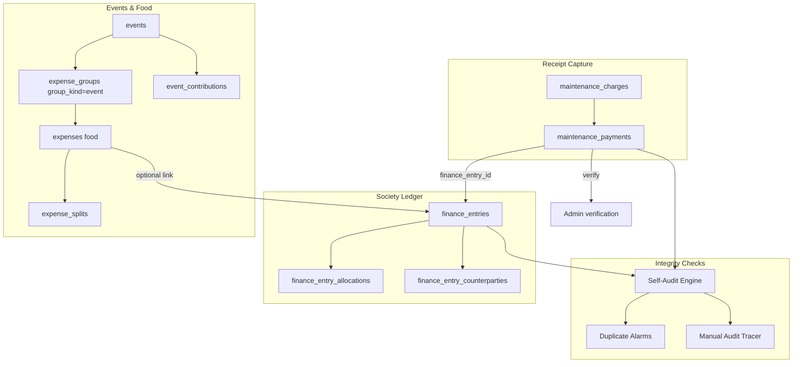

# Financial Data Flow — Kutumbika V2

Traceability model for fair and transparent accounting.

---

## Money record types

The system maintains **separate but linked** record types. Do not assume one table holds all society money.

| Record type | Primary tables | Purpose |
|-------------|----------------|---------|
| **Receipt definitions** | `maintenance_charges` | Define what flats owe (amount, frequency, optional `expense_group_id` for head-linked charges) |
| **Flat payments** | `maintenance_payments` | Resident submissions; admin verifies; links to `finance_entry_id` when posted to ledger |
| **Society ledger** | `finance_entries`, `finance_entry_allocations`, `finance_entry_counterparties` | Treasurer-recorded cash movements; modes: `flats_only`, `flats_plus_outsider`, `outsider_only`, **`society_pool`** |
| **Event contributions** | `event_contributions` | Money collected for a specific event |
| **Event food bills** | `expenses` (category `food`) + `expense_splits` | Catering/food costs split across flats by headcount |
| **Society payment heads** | `expenses` (category `payment`) → migrated to `finance_entries` | Non-food society expenses (utilities, repairs, etc.) |
| **Donations** | `donation_payments` | Campaign receipts (separate from maintenance ledger) |
| **Head adjustments** | `head_fund_adjustments` | Manual corrections per expense head |
| **Reserve movements** | `reserve_fund_transfers` | Operating ↔ reserve ↔ fixed/emergency fund |

---

## Primary flow diagram

---

## Approval workflow

1. **Resident submits** payment (cash/UPI/screenshot) → `maintenance_payments.status = pending`
2. **Admin verifies** → status `verified` or `rejected`
3. **Ledger posting** — verified payment may create or link `finance_entries` row with `finance_entry_id`
4. **Period report** — aggregates **verified** ledger rows by channel and date range
5. **Self-audit** — compares `maintenance_payments` totals vs `finance_entries` (recording vs reporting)

---

## Society pool workflow

1. Record receipt with `record_mode = society_pool` (no flat allocation yet)
2. Funds sit in pool until admin runs **distribute to flats**
3. System sets `distributed_at` and creates flat allocations

Migration: `20260602100000_finance_society_pool.sql`

---

## Events vs Finance boundary

| Question | Where to look |
|----------|---------------|
| Event food bill split among flats? | Events & food → `ExpenseSplitter` |
| Event contributions vs food cost balance? | `EventFoodReconciliation.tsx` |
| Society maintenance receipt? | Finance → Record receipt / Transactions |
| Non-food society expense (e.g. lift repair)? | Finance → Record payment / Transactions |
| Treasurer period summary? | Finance → Period report |
| Month cross-module summary? | REPORTS → Financial tab |

**Important:** Event food expenses do **not** automatically appear in Finance → Transactions unless explicitly linked via migration or manual ledger entry.

---

## Reconciliation support

| Tool | What it reconciles |
|------|-------------------|
| **Self-Audit Engine** | Cash/bank balances, duplicates, recording vs reporting, ledger double-count, orphans |
| **Duplicate Alarms** | Same flat + charge + month + channel |
| **Manual Audit Tracer** | Period report vs payments vs Transactions tab (single month) |
| **Head Fund Reconciliation** | Per expense-head inflow/outflow vs adjustments |
| **EventFoodReconciliation** | Event contributions vs food bills |
| **MonthlyOperatingFundPanel** | Operating surplus/deficit vs reserve transfers |

---

## Traceability gaps (V2)

| Gap | Severity | V2.1 recommendation |
|-----|----------|----------------------|
| No immutable finance change log | High | Append-only `finance_audit_log` table |
| Ledger edits overwrite prior state | Medium | Soft-delete + version column on `finance_entries` |
| Event food ↔ ledger link optional | Medium | Required `finance_entry_id` on food expenses when paid from corpus |
| Donations outside ledger | Low (by design) | Document in treasurer training materials |

---

## Reporting sources

| Report | Data source |
|--------|-------------|
| Finance → Period report | `finance_entries` (verified, date range, channels) |
| Finance → Flat report | Allocations + payments per flat |
| Finance → Transactions | All ledger rows + filters |
| REPORTS → Financial | Gross ledger groups, verified net, maintenance from ledger, event food from groups, donations |
| Admin Home KPI — maintenance | Verified `maintenance_payments` + unlinked verified ledger receipts |
| Admin Home KPI — event food | Active `expenses` where `expense_category=food`, `group_kind=event` |

---

*See also [OVERVIEW.md](./OVERVIEW.md) and [USER-ROLE-MATRIX.md](./USER-ROLE-MATRIX.md).*
