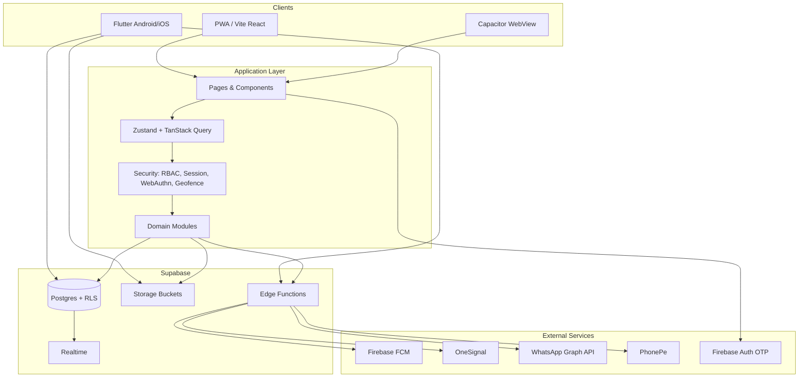
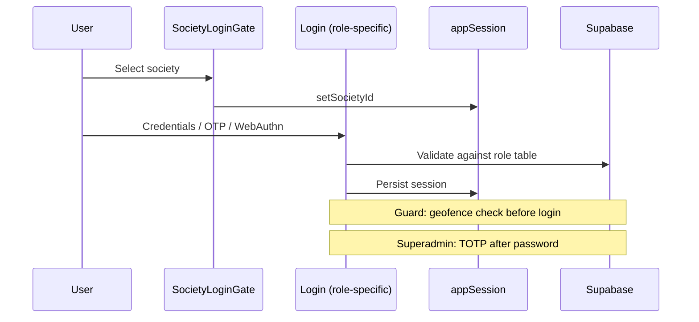
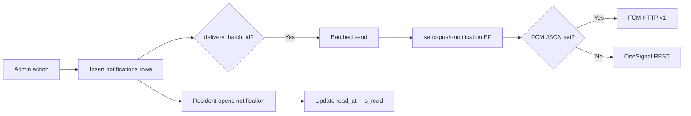

# Architecture Overview — Kutumbika V2

System architecture aligned with the seven objectives in [README.md](../README.md).

---

## System context

---

## Logical layers

| Layer | Responsibility | Key paths |
|-------|----------------|-----------|
| **User Interface** | Role dashboards, forms, reports | `src/pages/*`, `src/components/*` (web); `mobile/lib/*` (Flutter) |
| **Configuration** | Env vars, society settings, geofence | `.env`, `SettingsPage`, `geofence_settings` |
| **Core Engine** | State, caching, session | `useStore.ts`, TanStack Query, `appSession.ts` |
| **Security** | AuthN/Z, audit, geofence, MFA | `adminPermissions.ts`, `auditLogger.ts`, `useBiometric.ts` |
| **Accounting** | Ledger, reconciliation, self-audit | `FinanceManager.tsx`, `financeAuditDetection.ts` |
| **Monitoring** | KPIs, alerts, notifications | `AdminDashboard.tsx`, `EmergencyAlertPanel.tsx`, `NotificationCenter.tsx` |
| **Reporting** | Period report, REPORTS tab, PDF | `ReportPage.tsx`, `financePeriodReportPdf.ts` |
| **Integration** | Push, OTP, payments, backup | `supabase/functions/*` |

---

## Module map (by objective)

| Objective | Modules | Primary tables |
|-----------|---------|----------------|
| Security surveillance | Gate, guards, vehicles, blacklist, geofence | `visitors`, `guards`, `geofence_settings` |
| Monitoring & alerts | Notifications, emergency, admin KPIs | `notifications`, `emergency_alerts`, `fcm_web_tokens` |
| Fair accounting | Finance, events/food, donations | `finance_entries`, `maintenance_payments`, `expenses` |
| Understandable reporting | REPORTS, period report, flat report | Aggregations over finance + gate tables |
| Operational flexibility | Multi-society, RBAC, society pool | `societies`, `society_roles`, `admins` |
| Auditability | Audit tab, meetings, elections | `audit_logs`, `meetings`, `poll_election_ballots` |
| Future scalability | Edge functions, Flutter + Capacitor | Stateless functions; horizontal Supabase scaling |

---

## Authentication flow

---

## Notification delivery flow

---

## Security caveats (V2)

1. **RLS:** Many policies are permissive (`USING (true)`). Society isolation relies on client-side `society_id` filters.
2. **RBAC:** Tab-level UI gates; not all CRUD actions have separate permission checks.
3. **Audit logs:** Security events logged; finance mutations largely not in `audit_logs`.
4. **Recommended V2.1:** Society-scoped RLS policies, finance change log, action-level permissions.

---

## Recommended additional diagrams

| Diagram | Status | Location |
|---------|--------|----------|
| System overview | This file | `OVERVIEW.md` |
| Financial data flow | [FINANCIAL-DATA-FLOW.md](./FINANCIAL-DATA-FLOW.md) | Created |
| User role matrix | [USER-ROLE-MATRIX.md](./USER-ROLE-MATRIX.md) | Created |
| Deployment | Partial (README Getting started) | Future: `DEPLOYMENT.md` |
| Security hardening target | Partial (this file) | Future: `SECURITY-MODEL.md` |

---

*Aligned with V2 through `20260707150000`. Mobile details: [mobile/README.md](../../mobile/README.md), [PARITY-ROADMAP.md](../mobile/PARITY-ROADMAP.md).*
